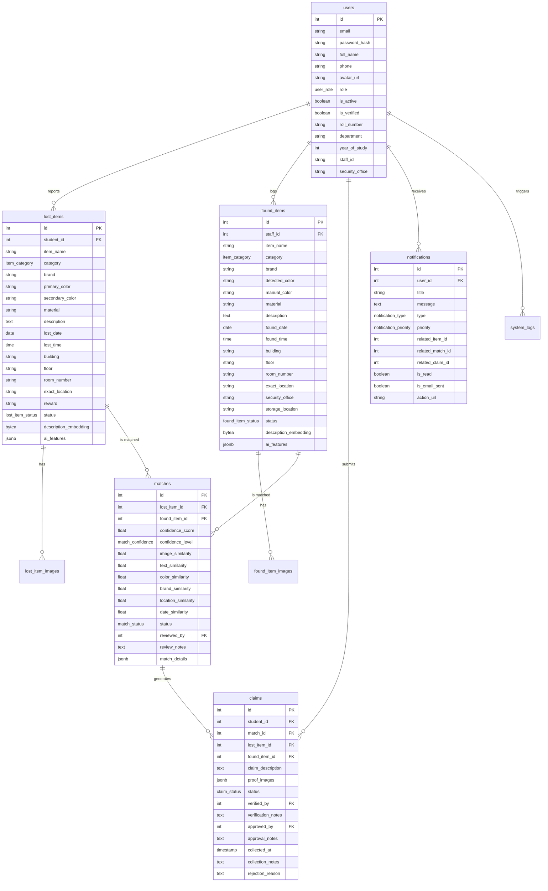

# FindIt Campus — Database Schema

```mermaid
erDiagram
    users ||--o{ lost_items : "reports"
    users ||--o{ found_items : "logs"
    users ||--o{ claims : "submits"
    users ||--o{ notifications : "receives"
    users ||--o{ system_logs : "triggers"
    
    lost_items ||--o{ lost_item_images : "has"
    lost_items ||--o{ matches : "is matched"
    
    found_items ||--o{ found_item_images : "has"
    found_items ||--o{ matches : "is matched"
    
    matches ||--o{ claims : "generates"

    users {
        int id PK
        string email
        string password_hash
        string full_name
        string phone
        string avatar_url
        user_role role
        boolean is_active
        boolean is_verified
        string roll_number
        string department
        int year_of_study
        string staff_id
        string security_office
    }

    lost_items {
        int id PK
        int student_id FK
        string item_name
        item_category category
        string brand
        string primary_color
        string secondary_color
        string material
        text description
        date lost_date
        time lost_time
        string building
        string floor
        string room_number
        string exact_location
        string reward
        lost_item_status status
        bytea description_embedding
        jsonb ai_features
    }

    found_items {
        int id PK
        int staff_id FK
        string item_name
        item_category category
        string brand
        string detected_color
        string manual_color
        string material
        text description
        date found_date
        time found_time
        string building
        string floor
        string room_number
        string exact_location
        string security_office
        string storage_location
        found_item_status status
        bytea description_embedding
        jsonb ai_features
    }

    matches {
        int id PK
        int lost_item_id FK
        int found_item_id FK
        float confidence_score
        match_confidence confidence_level
        float image_similarity
        float text_similarity
        float color_similarity
        float brand_similarity
        float location_similarity
        float date_similarity
        match_status status
        int reviewed_by FK
        text review_notes
        jsonb match_details
    }

    claims {
        int id PK
        int student_id FK
        int match_id FK
        int lost_item_id FK
        int found_item_id FK
        text claim_description
        jsonb proof_images
        claim_status status
        int verified_by FK
        text verification_notes
        int approved_by FK
        text approval_notes
        timestamp collected_at
        text collection_notes
        text rejection_reason
    }

    notifications {
        int id PK
        int user_id FK
        string title
        text message
        notification_type type
        notification_priority priority
        int related_item_id
        int related_match_id
        int related_claim_id
        boolean is_read
        boolean is_email_sent
        string action_url
    }
```
